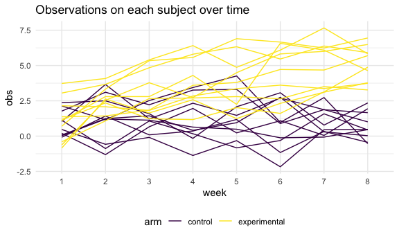
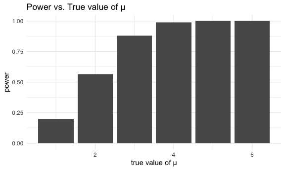
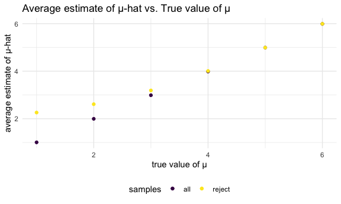

Homework 5
================
Lunbei Hu
2020-11-18

This is my solution to HW5.

## Problem 1

The raw dataset contains information about criminal homicides in 50
large U.S. cities from 2012 to 2017, collected by The Washington Post.
The variable included are the location of the killing, whether an arrest
was made and, in most cases, basic demographic information about each
victim.

Read in the data.

``` r
homocide_df = 
  read_csv("homicide_data/homicide-data.csv") %>% 
  mutate(
    city_state = str_c(city, state, sep = "_"),
    resolved = case_when(
      disposition == "Closed without arrest" ~ "unsolved",
      disposition == "Open/No arrest"        ~ "unsolved",
      disposition == "Closed by arrest"      ~ "solved",
    )
  ) %>% 
  select(city_state, resolved) %>% 
  filter(city_state != "Tulsa_AL")
```

    ## Parsed with column specification:
    ## cols(
    ##   uid = col_character(),
    ##   reported_date = col_double(),
    ##   victim_last = col_character(),
    ##   victim_first = col_character(),
    ##   victim_race = col_character(),
    ##   victim_age = col_character(),
    ##   victim_sex = col_character(),
    ##   city = col_character(),
    ##   state = col_character(),
    ##   lat = col_double(),
    ##   lon = col_double(),
    ##   disposition = col_character()
    ## )

Let’s look at this a bit

``` r
aggregate_df = 
  homocide_df %>% 
  group_by(city_state) %>% 
  summarize(
    hom_total = n(),
    hom_unsolved = sum(resolved == "unsolved")
  )
```

    ## `summarise()` ungrouping output (override with `.groups` argument)

Can I do a prop test for a single city?

``` r
prop.test(
  aggregate_df %>% filter(city_state == "Baltimore_MD") %>% pull(hom_unsolved), 
  aggregate_df %>% filter(city_state == "Baltimore_MD") %>% pull(hom_total)) %>% 
  broom::tidy()
```

    ## # A tibble: 1 x 8
    ##   estimate statistic  p.value parameter conf.low conf.high method    alternative
    ##      <dbl>     <dbl>    <dbl>     <int>    <dbl>     <dbl> <chr>     <chr>      
    ## 1    0.646      239. 6.46e-54         1    0.628     0.663 1-sample… two.sided

Try to iterate …….

``` r
results_df = 
  aggregate_df %>% 
  mutate(
    prop_tests = map2(.x = hom_unsolved, .y = hom_total, ~prop.test(x = .x, n = .y)),
    tidy_tests = map(.x = prop_tests, ~broom::tidy(.x))
  ) %>% 
  select(-prop_tests) %>% 
  unnest(tidy_tests) %>% 
  select(city_state, estimate, conf.low, conf.high)
```

Create a plot that shows the estimates of the proportion of unsolved
homicides and CIs for each city.

``` r
results_df %>% 
  mutate(city_state = fct_reorder(city_state, estimate)) %>% 
  ggplot(aes(x = city_state, y = estimate)) +
  geom_point() +
  geom_errorbar(aes(ymin = conf.low, ymax = conf.high)) +
  theme(axis.text.x = element_text(angle = 90, vjust = 0.5, hjust = 1))
```


## Problem 2

Iterate over the file names, read in data for each subject, and save the
result as a new variable.

``` r
path_df = 
  tibble(
    subject = list.files("lda_data"),
  ) %>% 
  mutate(
    path = str_c("lda_data/", subject),
    data = map(.x = path, ~read_csv(.x))
  ) 
```

    ## Parsed with column specification:
    ## cols(
    ##   week_1 = col_double(),
    ##   week_2 = col_double(),
    ##   week_3 = col_double(),
    ##   week_4 = col_double(),
    ##   week_5 = col_double(),
    ##   week_6 = col_double(),
    ##   week_7 = col_double(),
    ##   week_8 = col_double()
    ## )
    ## Parsed with column specification:
    ## cols(
    ##   week_1 = col_double(),
    ##   week_2 = col_double(),
    ##   week_3 = col_double(),
    ##   week_4 = col_double(),
    ##   week_5 = col_double(),
    ##   week_6 = col_double(),
    ##   week_7 = col_double(),
    ##   week_8 = col_double()
    ## )
    ## Parsed with column specification:
    ## cols(
    ##   week_1 = col_double(),
    ##   week_2 = col_double(),
    ##   week_3 = col_double(),
    ##   week_4 = col_double(),
    ##   week_5 = col_double(),
    ##   week_6 = col_double(),
    ##   week_7 = col_double(),
    ##   week_8 = col_double()
    ## )
    ## Parsed with column specification:
    ## cols(
    ##   week_1 = col_double(),
    ##   week_2 = col_double(),
    ##   week_3 = col_double(),
    ##   week_4 = col_double(),
    ##   week_5 = col_double(),
    ##   week_6 = col_double(),
    ##   week_7 = col_double(),
    ##   week_8 = col_double()
    ## )
    ## Parsed with column specification:
    ## cols(
    ##   week_1 = col_double(),
    ##   week_2 = col_double(),
    ##   week_3 = col_double(),
    ##   week_4 = col_double(),
    ##   week_5 = col_double(),
    ##   week_6 = col_double(),
    ##   week_7 = col_double(),
    ##   week_8 = col_double()
    ## )
    ## Parsed with column specification:
    ## cols(
    ##   week_1 = col_double(),
    ##   week_2 = col_double(),
    ##   week_3 = col_double(),
    ##   week_4 = col_double(),
    ##   week_5 = col_double(),
    ##   week_6 = col_double(),
    ##   week_7 = col_double(),
    ##   week_8 = col_double()
    ## )
    ## Parsed with column specification:
    ## cols(
    ##   week_1 = col_double(),
    ##   week_2 = col_double(),
    ##   week_3 = col_double(),
    ##   week_4 = col_double(),
    ##   week_5 = col_double(),
    ##   week_6 = col_double(),
    ##   week_7 = col_double(),
    ##   week_8 = col_double()
    ## )
    ## Parsed with column specification:
    ## cols(
    ##   week_1 = col_double(),
    ##   week_2 = col_double(),
    ##   week_3 = col_double(),
    ##   week_4 = col_double(),
    ##   week_5 = col_double(),
    ##   week_6 = col_double(),
    ##   week_7 = col_double(),
    ##   week_8 = col_double()
    ## )
    ## Parsed with column specification:
    ## cols(
    ##   week_1 = col_double(),
    ##   week_2 = col_double(),
    ##   week_3 = col_double(),
    ##   week_4 = col_double(),
    ##   week_5 = col_double(),
    ##   week_6 = col_double(),
    ##   week_7 = col_double(),
    ##   week_8 = col_double()
    ## )
    ## Parsed with column specification:
    ## cols(
    ##   week_1 = col_double(),
    ##   week_2 = col_double(),
    ##   week_3 = col_double(),
    ##   week_4 = col_double(),
    ##   week_5 = col_double(),
    ##   week_6 = col_double(),
    ##   week_7 = col_double(),
    ##   week_8 = col_double()
    ## )
    ## Parsed with column specification:
    ## cols(
    ##   week_1 = col_double(),
    ##   week_2 = col_double(),
    ##   week_3 = col_double(),
    ##   week_4 = col_double(),
    ##   week_5 = col_double(),
    ##   week_6 = col_double(),
    ##   week_7 = col_double(),
    ##   week_8 = col_double()
    ## )
    ## Parsed with column specification:
    ## cols(
    ##   week_1 = col_double(),
    ##   week_2 = col_double(),
    ##   week_3 = col_double(),
    ##   week_4 = col_double(),
    ##   week_5 = col_double(),
    ##   week_6 = col_double(),
    ##   week_7 = col_double(),
    ##   week_8 = col_double()
    ## )
    ## Parsed with column specification:
    ## cols(
    ##   week_1 = col_double(),
    ##   week_2 = col_double(),
    ##   week_3 = col_double(),
    ##   week_4 = col_double(),
    ##   week_5 = col_double(),
    ##   week_6 = col_double(),
    ##   week_7 = col_double(),
    ##   week_8 = col_double()
    ## )
    ## Parsed with column specification:
    ## cols(
    ##   week_1 = col_double(),
    ##   week_2 = col_double(),
    ##   week_3 = col_double(),
    ##   week_4 = col_double(),
    ##   week_5 = col_double(),
    ##   week_6 = col_double(),
    ##   week_7 = col_double(),
    ##   week_8 = col_double()
    ## )
    ## Parsed with column specification:
    ## cols(
    ##   week_1 = col_double(),
    ##   week_2 = col_double(),
    ##   week_3 = col_double(),
    ##   week_4 = col_double(),
    ##   week_5 = col_double(),
    ##   week_6 = col_double(),
    ##   week_7 = col_double(),
    ##   week_8 = col_double()
    ## )
    ## Parsed with column specification:
    ## cols(
    ##   week_1 = col_double(),
    ##   week_2 = col_double(),
    ##   week_3 = col_double(),
    ##   week_4 = col_double(),
    ##   week_5 = col_double(),
    ##   week_6 = col_double(),
    ##   week_7 = col_double(),
    ##   week_8 = col_double()
    ## )
    ## Parsed with column specification:
    ## cols(
    ##   week_1 = col_double(),
    ##   week_2 = col_double(),
    ##   week_3 = col_double(),
    ##   week_4 = col_double(),
    ##   week_5 = col_double(),
    ##   week_6 = col_double(),
    ##   week_7 = col_double(),
    ##   week_8 = col_double()
    ## )
    ## Parsed with column specification:
    ## cols(
    ##   week_1 = col_double(),
    ##   week_2 = col_double(),
    ##   week_3 = col_double(),
    ##   week_4 = col_double(),
    ##   week_5 = col_double(),
    ##   week_6 = col_double(),
    ##   week_7 = col_double(),
    ##   week_8 = col_double()
    ## )
    ## Parsed with column specification:
    ## cols(
    ##   week_1 = col_double(),
    ##   week_2 = col_double(),
    ##   week_3 = col_double(),
    ##   week_4 = col_double(),
    ##   week_5 = col_double(),
    ##   week_6 = col_double(),
    ##   week_7 = col_double(),
    ##   week_8 = col_double()
    ## )
    ## Parsed with column specification:
    ## cols(
    ##   week_1 = col_double(),
    ##   week_2 = col_double(),
    ##   week_3 = col_double(),
    ##   week_4 = col_double(),
    ##   week_5 = col_double(),
    ##   week_6 = col_double(),
    ##   week_7 = col_double(),
    ##   week_8 = col_double()
    ## )

Tidy the result: manipulate file names to include control arm and
subject ID, and pivot the data from wide to long.

``` r
study_df = 
  path_df %>% 
  select(-path) %>% 
  unnest(data) %>% 
  mutate(subject = str_replace_all(subject, ".csv", "")) %>% 
  separate(subject, into = c("arm", "subject_id"), remove = FALSE) %>% 
  mutate(arm = recode(arm, "con" = "control","exp" = "experimental")) %>% 
  pivot_longer(
    week_1:week_8,
    names_to = "week",
    names_prefix = "week_",
    values_to = "obs"
  ) 
```

Make a spaghetti plot showing observations on each subject over time.

``` r
study_df %>% 
  ggplot(aes(x = week, y = obs, group = subject, color = arm)) +
  geom_line()
```



Overtime, for the experimental arm, observations tend to increase while
for the control arm, observations almost stay the same.

## Problem 3

Generate 5000 datasets from the normal distribution, save estimated
means from simulation and and p-values from t test.

``` r
sim_mean_p = function(samp_size = 30, mu, sigma = 5) {
  
  sim_data = 
    tibble(
      x = rnorm(n = samp_size, mean = mu, sd = sigma)
    )
  
  sim_data %>% 
    t.test() %>% 
    broom::tidy() %>% 
    select(estimate, p.value)
  
}

sim_results = 
  rerun(5000, sim_mean_p(mu = 0)) %>% 
  bind_rows()
```

Repeat the above for µ = {1,2,3,4,5,6}.

``` r
sim_results =
  tibble(
    mu_value = c(1:6)
  ) %>% 
    mutate(
      output_lists = map(.x = mu_value, ~rerun(5000, sim_mean_p(mu = .x))),
      estimate_df = map(output_lists, bind_rows)
    ) %>% 
    select(-output_lists) %>% 
    unnest(estimate_df)
```

Make a plot showing the proportion of times the null was rejected
(power) vs. the true value of µ.

``` r
rejected_df = 
  sim_results %>% 
  mutate(rejected = ifelse(p.value < 0.05, "reject", "not reject"))

rejected_df %>%
  group_by(mu_value) %>% 
  summarize(prop_rejected = sum(rejected == "reject")/n()) %>% 
  ggplot(aes(x = mu_value, y = prop_rejected)) +
  geom_bar(stat = "identity") +
  labs(x = "true value of µ", y = "power")
```

    ## `summarise()` ungrouping output (override with `.groups` argument)



Since we assume µ = 0 and effect size is calculated by the true value of
µ - 0 = true value of µ, we can treat x axis as a representation of
effect size. As effect size increases, power also increases - from fast
to slow, until power reaches 1.

1)  Make a plot showing the average estimate of µ-hat vs. the true value
    of µ.

2)  Make a plot showing the average estimate of µ-hat only in samples
    for which the null was rejected vs. the true value of µ.

Two separate plots:

``` r
all_plot = 
  rejected_df %>%
  group_by(mu_value) %>% 
  summarize(mean_mu = mean(estimate)) %>% 
  ggplot(aes(x = mu_value, y = mean_mu)) +
  geom_point() +
  labs(x = "true value of µ", y = "average estimate of µ-hat", 
       title = "All samples")
```

    ## `summarise()` ungrouping output (override with `.groups` argument)

``` r
rejected_plot = 
  rejected_df %>%
  filter(rejected == "reject") %>% 
  group_by(mu_value) %>% 
  summarize(mean_mu = mean(estimate)) %>% 
  ggplot(aes(x = mu_value, y = mean_mu)) +
  geom_point() +
  labs(x = "true value of µ", y = "average estimate of µ-hat",
       title = "Samples where the null was rejected")
```

    ## `summarise()` ungrouping output (override with `.groups` argument)

``` r
all_plot + rejected_plot
```



One plot (the second plot overlays on the first):

``` r
all_plot_df = 
  rejected_df %>%
  group_by(mu_value) %>% 
  summarize(mean_mu = mean(estimate)) %>% 
  mutate(samples = "all")
```

    ## `summarise()` ungrouping output (override with `.groups` argument)

``` r
rejected_plot_df = 
  rejected_df %>%
  filter(rejected == "reject") %>% 
  group_by(mu_value) %>% 
  summarize(mean_mu = mean(estimate)) %>% 
  mutate(samples = "reject")
```

    ## `summarise()` ungrouping output (override with `.groups` argument)

``` r
ggplot(data = all_plot_df, aes(x = mu_value, y = mean_mu, color = samples)) + 
  geom_point() + 
  geom_point(data = rejected_plot_df) +
  labs(x = "true value of µ", y = "average estimate of µ-hat")
```


When µ is smaller than 3, the sample average of µ-hat across tests for
which the null is rejected approximately equal to the true value of µ.
But µ gets larger, the sample average of µ-hat across tests where the
null is rejected approaches (even coincides with) the true value of µ.

  - The reasoning: In the previous bar graph, we can see the power is
    relatively low when µ is smaller than 3, which means the proportion
    of times the null was rejected is low. Therefore, the number of
    samples with µ smaller than 3 and the null is rejected is relatively
    small. These sample means indeed have more variation and their
    average is more likely to deviate from the true mean. However, as µ
    gets bigger, there are more samples with rejected null, so the
    sample average of µ-hat becomes more stable and yields a more
    unbiased estimation of the true mean.
